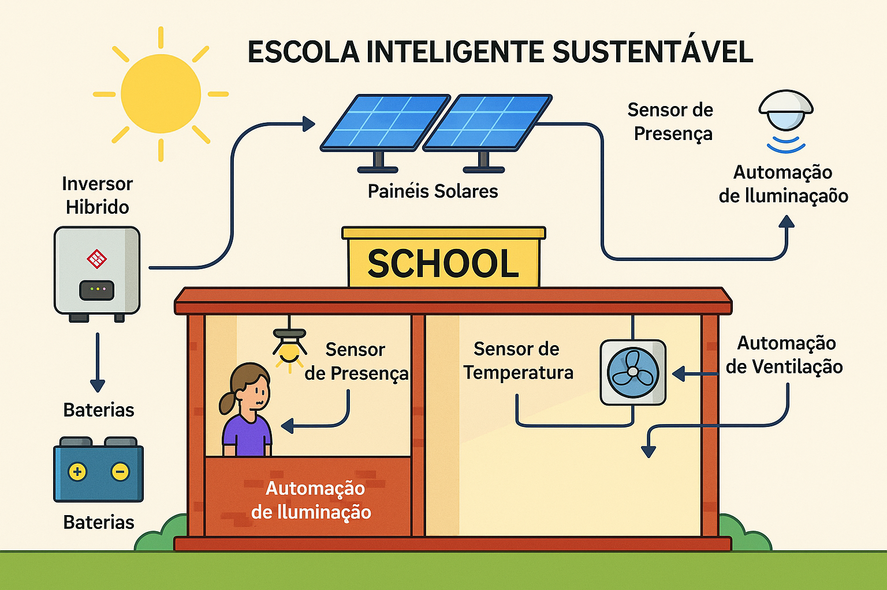
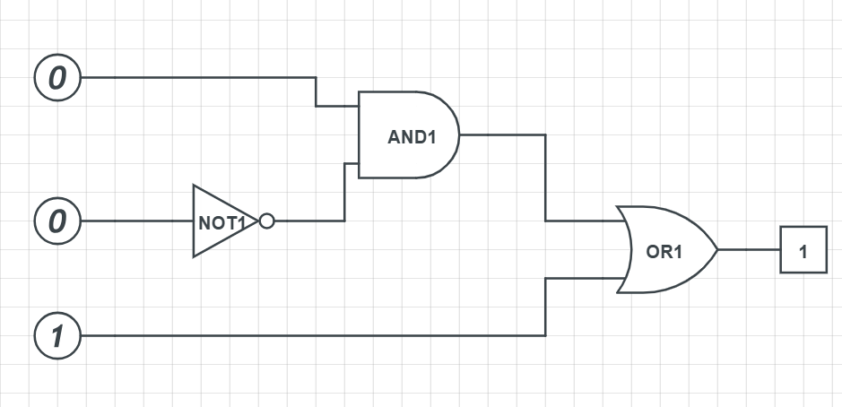
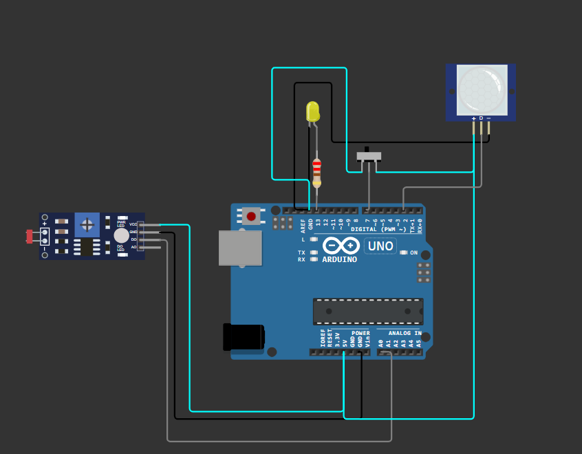
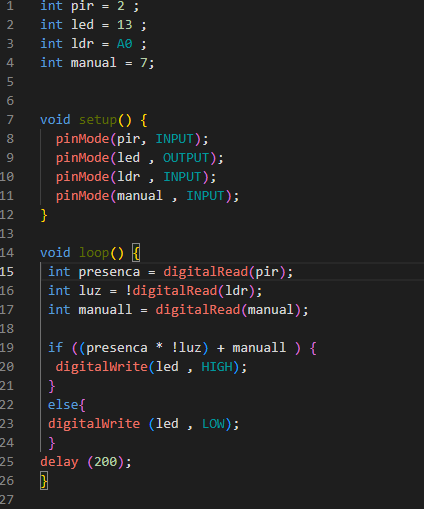

# 🌱 Escola Inteligente Sustentável  
**Projeto SPRINT 1 – Escola Automatizada com Energia Solar**  
*Disciplina: Exploração de Energias Renováveis e Tecnologias Sustentáveis – FIAP*  
**Turma:** 1CCPI | 👨‍🏫 *Professor:* Álvaro Alexandre Rezende Gonçalves  

---

## 🎯 Objetivo do Projeto  
Reduzir o consumo de energia elétrica em escolas públicas por meio da integração de **energia solar fotovoltaica**, **automação inteligente com sensores** e **sistemas de monitoramento remoto em tempo real**.

---

## 👥 Integrantes  
- Cauã Ferreira Muniz  
- Bernardo  
- João Vitor Anceloti  
- Matheus  
- Rafael Ferreira  

---

## 💡 Proposta de Solução  

Nossa solução consiste na criação de uma infraestrutura escolar sustentável e automatizada, com os seguintes componentes:

- **Energia Solar**: Instalação de **painéis solares** conectados a um **inversor híbrido GoodWe**, com possibilidade de integração a **baterias inteligentes** para armazenamento de energia.  
- **Automação de Iluminação e Climatização**: Utilização de **sensores de presença (PIR)** e **sensor de luminosidade (LDR)** para controle automático de luzes e ventilação.  
- **Lógica de Controle Inteligente**: Implementação da lógica booleana:
garantindo conforto e economia energética.  
- **Monitoramento Remoto**: Visualização de dados de desempenho e consumo via **SEMS Portal**, com integração futura a **dashboards personalizados (Node-RED / Blynk)** para análise e controle.  

---

## 🔁 Simulação no Wokwi  

Um protótipo da automação foi desenvolvido e testado com **Arduino Uno** no simulador online **Wokwi**.  
🔗 Acesse a simulação:  
[https://wokwi.com/projects/432385566733770753](https://wokwi.com/projects/432385566733770753)

---

## 🛠️ Tecnologias e Ferramentas Utilizadas  
- **Energia**: Painéis solares fotovoltaicos (GoodWe), inversor híbrido GW-ET / GW-ES  
- **Automação**: Arduino Uno (via Wokwi), sensores PIR, LDR e botão  
- **Monitoramento**: SEMS Portal, dashboards (Node-RED / Blynk - planejados)  
- **Documentação e Versionamento**: GitHub  
- **Apresentação**: Vídeo Pitch + PDF  

---

## 📝 Documentação  

📄 **PDF:** [`SPRINT.pdf`](./SPRINT.pdf) *(anexo)*  

📷 **Imagens do projeto**:  
-   
-   

💻 **Código e lógica:** Capturas de tela da simulação no Wokwi *(anexadas)*  
- .
- .
- . 

---

## 🎥 Vídeo Pitch  
📺 *Disponível no YouTube (modo não listado)*  
🔗 Link: *https://youtu.be/rW-RNfPbBXY*

---

## 📚 Conexão com a Disciplina  

Este projeto aplica os principais conceitos abordados na disciplina:  
- Energias renováveis (uso de energia solar e baterias)  
- Automação residencial e educacional com Arduino  
- Eficiência energética e sustentabilidade  
- Internet das Coisas (IoT) com monitoramento remoto e controle via dashboards  

---

> **“Tecnologia e consciência ambiental para transformar a educação pública.”**
